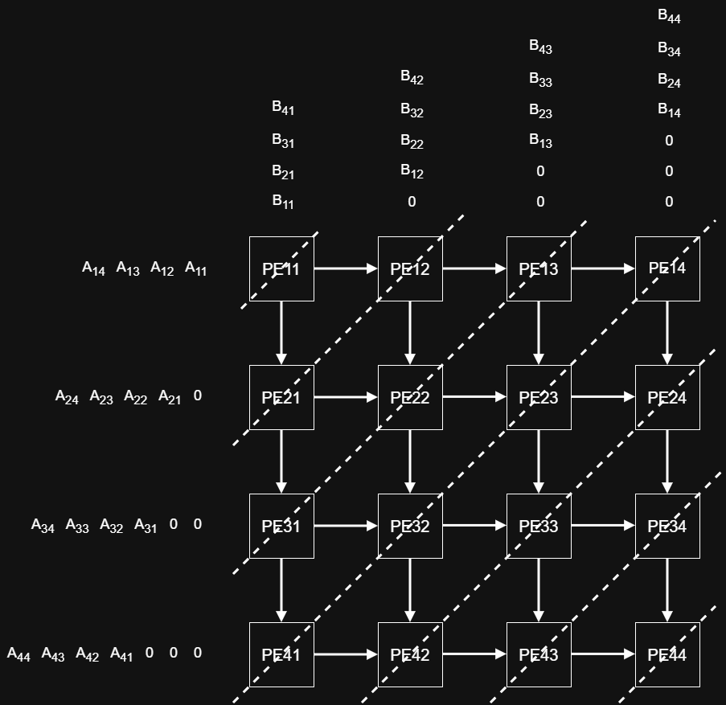
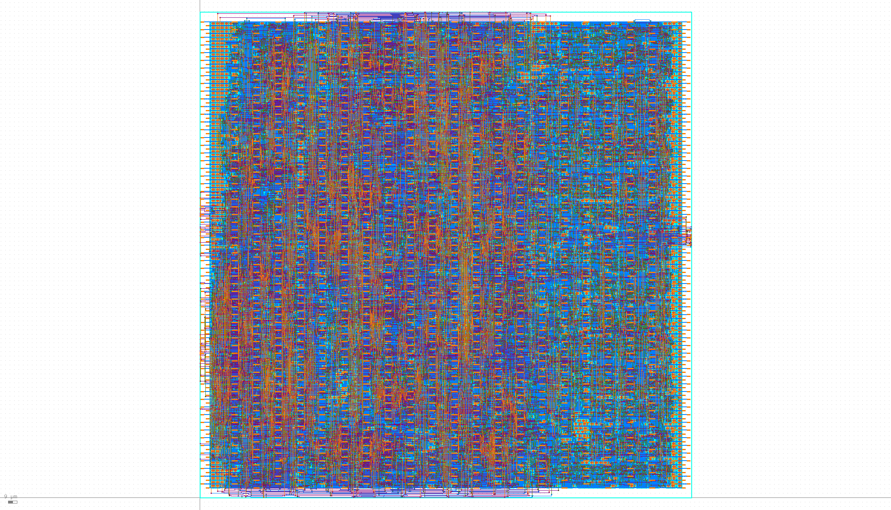

# Systolic-Array-Matmul-Accelerator

This repository contains the **baseline-1** RTL design of a **4×4 systolic-array-based matrix multiplication accelerator** written in Verilog/SystemVerilog, together with a lightweight RTL testbench suite.

The design demonstrates the core idea of systolic dataflow: matrix **A** streams horizontally, matrix **B** streams vertically, and skewed inputs are used to align multiply-accumulate operations in time. Each processing element (PE) contributes to one output entry through temporal accumulation and local data forwarding.

## Baseline-1 Design

This repository corresponds to the **baseline-1** version of our accelerator.

Main features:
- 4×4 matrix multiplication accelerator
- systolic-array datapath
- skewed input scheduling for A and B
- signed 8-bit input elements
- local multiply-accumulate processing in each PE

## Architecture Overview

The figure below illustrates the **4×4 processing-element (PE) systolic array** used in the baseline-1 design.

In this architecture, matrix **A** is streamed **row-wise from left to right**, while matrix **B** is streamed **column-wise from top to bottom**. Skewed input scheduling with zero padding is used so that operands arrive at each PE in the correct cycle alignment for multiply-accumulate computation.

Each PE performs three local tasks:
- receives one element from the **A** stream and one element from the **B** stream
- computes the local multiply-accumulate update for the corresponding partial sum
- forwards **A** horizontally and **B** vertically to neighboring PEs

This systolic dataflow enables regular local interconnect, modular scalability, and efficient matrix multiplication through temporal accumulation across the array.



## Accelerator Interface

The accelerator communicates with the external system through a **request/response streaming interface** with **val/rdy handshaking**.

### Request channel

The request interface uses the following signals:

- **`xcel_reqstream_msg`**: packed accelerator request message
- **`xcel_reqstream_val`**: request valid signal from the sender
- **`xcel_reqstream_rdy`**: request ready signal from the accelerator

A request transaction occurs only when both **`xcel_reqstream_val`** and **`xcel_reqstream_rdy`** are high in the same cycle.

The request message format is defined as:

- **`type_`**: request type (`READ` or `WRITE`)
- **`addr`**: 5-bit accelerator register address
- **`data`**: 32-bit write data

This allows the external controller to either write matrix data / control registers into the accelerator or read back computation results.

### Response channel

The response interface uses the following signals:

- **`xcel_respstream_msg`**: packed accelerator response message
- **`xcel_respstream_val`**: response valid signal from the accelerator
- **`xcel_respstream_rdy`**: response ready signal from the receiver

A response transaction occurs only when both **`xcel_respstream_val`** and **`xcel_respstream_rdy`** are high in the same cycle.

The response message format is defined as:

- **`type_`**: response type (`READ` or `WRITE`)
- **`data`**: 32-bit response data

For write requests, the response indicates completion of the write transaction. For read requests, the response returns the requested 32-bit register value.

This **latency-insensitive val/rdy protocol** cleanly decouples the accelerator from the surrounding system and makes the design easier to integrate, simulate, and verify.

## Repository Structure

### `rtl/`

Contains the RTL implementation.

- **`Proj_44_Xcel.v`**  
  Top-level module of the accelerator. It connects the control path and datapath and exposes the request/response accelerator interface.

- **`xcel-msgs.v`**  
  Defines the accelerator request and response message formats, including packed struct typedefs and message type macros.

- **`XcelCtrl.v`**  
  Control logic of the accelerator. It handles request decoding, scheduling, enable generation, and response timing.

- **`XcelDpath.v`**  
  Datapath of the accelerator. It stores matrix inputs, generates skewed systolic inputs, connects the PE array, and prepares read responses.

- **`XcelPE.v`**  
  Processing element module. Each PE forwards input operands and performs multiply-accumulate operations.

### `tb/`

Contains RTL simulation testbenches.

- **`tb_common.vh`**  
  Shared helper tasks for reset, request generation, matrix loading, golden-model matrix multiplication, and result checking.

- **`tb_basic.v`**  
  Deterministic functional test using fixed positive-valued matrices.

- **`tb_signed.v`**  
  Functional test using signed matrix values to verify correct signed 8-bit handling and accumulation.

- **`tb_random.v`**  
  Randomized regression test for multiple matrix pairs.

## RTL Simulation

For the **public RTL version**, simulation is provided using **Icarus Verilog (`iverilog`)**, since this does not involve confidential implementation collateral.

In the actual project flow, RTL simulation was performed using **Synopsys VCS**. However, for open-source release and reproducibility, this repository uses **Icarus Verilog** for the public testbench flow.

### Run tests

```bash
mkdir Systolic-Array-Matmul-Accelerator/build
cd Systolic-Array-Matmul-Accelerator/build

iverilog -g2012 -I ../tb -I ../rtl -o simv_basic ../tb/tb_basic.v ../rtl/Proj_44_Xcel.v
vvp simv_basic

iverilog -g2012 -I ../tb -I ../rtl -o simv_signed ../tb/tb_signed.v ../rtl/Proj_44_Xcel.v
vvp simv_signed

iverilog -g2012 -I ../tb -I ../rtl -o simv_random ../tb/tb_random.v ../rtl/Proj_44_Xcel.v
vvp simv_random
```

## Physical Design Demo

To provide a simple demonstration beyond RTL, the figure below shows a **non-confidential physical layout** of the systolic-array matrix multiplication accelerator after backend implementation.

This layout was generated in a **TSMC 180nm** technology flow using **Cadence Innovus**.

Only a public, non-sensitive top-level layout view is included here for demonstration purposes.

